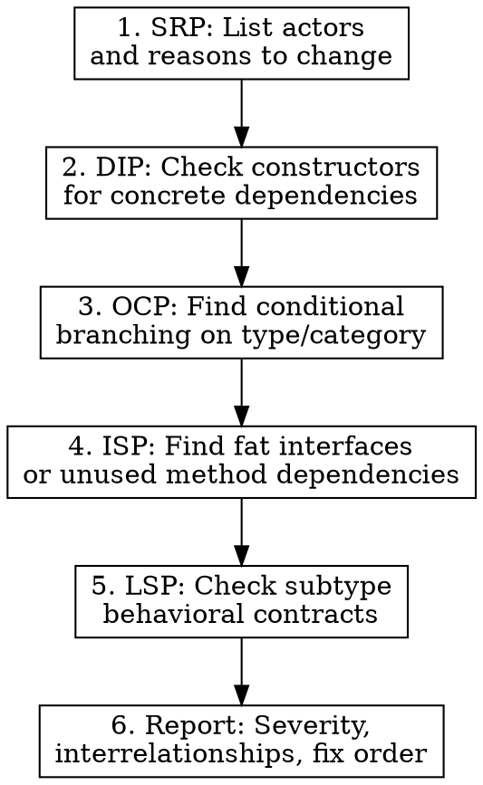

# SOLID Design Principles Review

Systematic design review and refactoring guidance based on Robert C. Martin's SOLID principles. All definitions sourced from Wikipedia articles on SOLID, SRP, OCP, LSP, ISP, and DIP.

## When to Use

- Reviewing existing code for design quality
- Designing new modules, classes, or interfaces
- Refactoring code that is hard to change or test
- Evaluating whether a proposed architecture will scale
- When code changes cascade across unrelated modules

## The Five Principles — Quick Reference

| Letter | Principle | Core Rule | Violation Smell |
|--------|-----------|-----------|-----------------|
| **S** | Single Responsibility | A module should be responsible to one, and only one, actor | Class changes for multiple unrelated reasons |
| **O** | Open-Closed | Open for extension, closed for modification | Adding a feature requires editing existing code (if/elif chains, switch statements) |
| **L** | Liskov Substitution | Subtypes must be substitutable for their base types without breaking the program | Subclass overrides weaken postconditions, strengthen preconditions, or violate invariants |
| **I** | Interface Segregation | No client should be forced to depend on methods it does not use | Classes implement interface methods they leave empty or throw NotImplementedError |
| **D** | Dependency Inversion | High-level modules should not depend on low-level modules; both should depend on abstractions | Constructors instantiate concrete collaborators; can't test without real infrastructure |

## Detailed Principles

### S — Single Responsibility Principle

**Martin's definition:** "A module should be responsible to one, and only one, actor." (Refined from the earlier formulation: "A class should have only one reason to change.")

An *actor* is a group of stakeholders or users who would request a change. Martin later clarified: "Gather together the things that change for the same reasons. Separate those things that change for different reasons." The principle derives from cohesion concepts by Tom DeMarco and Meilir Page-Jones.

**How to evaluate:** List every reason the class might need to change. If those reasons serve different actors (e.g., business rules vs. persistence vs. presentation), the class has too many responsibilities.

**Fix pattern:** Extract each responsibility into its own class. The original class becomes an orchestrator that delegates.

### O — Open-Closed Principle

**Meyer's original (1988):** "Software entities should be open for extension, but closed for modification." Meyer's mechanism was implementation inheritance.

**Martin's polymorphic reinterpretation (1996):** Use abstract interfaces rather than concrete inheritance. The interface is closed (stable contract); new behavior is added by implementing the interface, not by editing existing code. This aligns with David Parnas's information hiding and Craig Larman's Protected Variations pattern.

**How to evaluate:** Find conditional branches (if/elif/switch) that select behavior based on type or category. Each new category forces a modification. Ask: "Can I add a new variant without touching existing code?"

**Fix pattern:** Replace conditionals with polymorphism — define an abstraction, implement variants as separate classes, and use a registry or injection to select them.

### L — Liskov Substitution Principle

**Liskov & Wing's formal definition (1994):** "Let phi(x) be a property provable about objects x of type T. Then phi(y) should be true for objects y of type S where S is a subtype of T."

**Behavioral subtyping rules:**
- Preconditions cannot be strengthened in a subtype
- Postconditions cannot be weakened in a subtype
- Invariants of the supertype must be preserved
- History constraint: subtypes must not permit state changes the supertype prohibits (e.g., a mutable subtype of an immutable type violates LSP)
- Covariant return types, contravariant parameter types, no new exception types beyond subtypes of declared exceptions

**Classic violation — Square/Rectangle:** Making Square extend Rectangle breaks LSP because Square.setWidth() must also set height, violating Rectangle's postcondition that setWidth changes only width. Code written against Rectangle breaks when given a Square.

**How to evaluate:** For each subtype, verify: Does any method override strengthen what callers must provide? Weaken what callers can expect back? Permit state transitions the base type forbids? If consumer code needs to check `isinstance` to decide behavior, LSP is likely violated.

**Fix pattern:** Prefer composition over inheritance. If the "is-a" relationship does not hold behaviorally (not just conceptually), do not use inheritance.

### I — Interface Segregation Principle

**Martin's definition:** "No code should be forced to depend on methods it does not use." Originated from Martin's consulting at Xerox, where a monolithic Job class forced all clients to depend on stapling, faxing, and printing methods regardless of need, causing hour-long redeployment cycles.

**How to evaluate:** Look for interfaces or classes where some implementors leave methods empty, throw NotImplementedError, or return dummy values. Look for clients that receive a dependency but only call a subset of its methods.

**Fix pattern:** Split into role interfaces — small, cohesive interfaces where every method is relevant to every consumer. A single class can implement multiple role interfaces.

### D — Dependency Inversion Principle

**Martin's two statements:**
1. "High-level modules should not import anything from low-level modules. Both should depend on abstractions (e.g., interfaces)."
2. "Abstractions should not depend on details. Details (concrete implementations) should depend on abstractions."

The "inversion" means that high-level policy modules *own* the abstractions, and low-level implementation modules conform to them — reversing the conventional dependency direction. This is distinct from *dependency injection*, which is a pattern for providing concrete implementations at runtime.

**How to evaluate:** Check constructors and module imports. Does a high-level module (business logic) directly instantiate or import low-level modules (database drivers, HTTP clients, file I/O)? Can you unit-test the module without its infrastructure?

**Fix pattern:** Define abstractions (interfaces/protocols) owned by the high-level module. Inject concrete implementations from outside. The high-level module depends only on the abstraction it defines.

## Review Workflow

When reviewing code against SOLID, follow this order:

**Why this order:** SRP and DIP are structural — they reveal the dependency graph. OCP and ISP are about extension points and interface shape. LSP is about behavioral contracts in hierarchies. Fixing SRP and DIP often resolves OCP and ISP violations as a side effect.

## Principle Interrelationships

Principles are not independent. Understand how fixing one affects others:

- **SRP + DIP:** Extracting responsibilities (SRP) naturally creates the abstractions that DIP requires
- **DIP + OCP:** Depending on abstractions (DIP) makes the system open for extension (OCP) — new implementations of the abstraction extend behavior without modifying consumers
- **ISP + SRP:** Fat interfaces often indicate SRP violations in the implementing class; splitting responsibilities splits interfaces
- **LSP + OCP:** If subtypes honor base-type contracts (LSP), polymorphic extension (OCP) works safely

## Severity Assessment

When reporting violations, classify by impact:

| Severity | Criteria | Action |
|----------|----------|--------|
| **Critical** | Prevents testing, causes cascading changes across modules, or introduces runtime failures on substitution | Fix immediately |
| **High** | Forces modification of existing code for every new feature, or creates unnecessary coupling | Fix in current iteration |
| **Medium** | Code works but will resist change — latent design debt | Fix when touching the area |
| **Low** | Minor cohesion issue, single-use interface bloat | Note for future refactoring |

## Common Mistakes

| Mistake | Why It's Wrong |
|---------|---------------|
| Treating SRP as "a class should do one thing" | SRP is about actors and reasons to change, not about having few methods |
| Applying OCP everywhere preemptively | Only introduce extension points where variation actually exists or is concretely anticipated |
| Using inheritance to share code | Inheritance models "is-a" behavioral substitutability (LSP), not code reuse — use composition for reuse |
| Creating one interface per method | ISP means *role-based* segregation, not method-level fragmentation |
| Injecting everything | DIP applies to architectural boundaries; internal helper classes within a module don't need abstraction |

## Sources

All principle definitions and historical context sourced from:
- [SOLID — Wikipedia](https://en.wikipedia.org/wiki/SOLID)
- [Single-responsibility principle — Wikipedia](https://en.wikipedia.org/wiki/Single-responsibility_principle)
- [Open-closed principle — Wikipedia](https://en.wikipedia.org/wiki/Open%E2%80%93closed_principle)
- [Liskov substitution principle — Wikipedia](https://en.wikipedia.org/wiki/Liskov_substitution_principle)
- [Interface segregation principle — Wikipedia](https://en.wikipedia.org/wiki/Interface_segregation_principle)
- [Dependency inversion principle — Wikipedia](https://en.wikipedia.org/wiki/Dependency_inversion_principle)
